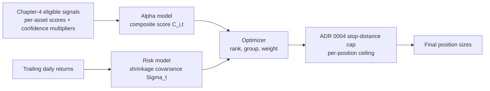

# Ensemble-construction engine v1 — disciplined design

Status: implemented (`backend/app/ensemble.py`, `2026-08-22`), smoke-tested
against two real candidates (see the smoke-test result linked from
[research-program.md](research-program.md) Chapter 4). Not yet used for
any real (even paper) sizing decision — this section's own checklist and
ADR 0010 §4's governance still gate that. Companion to [ADR
0010](adr/0010-long-short-ensemble-construction.md) (accepted) the same way
[strategy-library.md](strategy-library.md) is the mechanical companion to
[ADR 0009](adr/0009-strategy-onboarding-contract.md): the ADR records the
decision and its reasoning; this document is the exact, implementable
procedure, precise enough that two different implementations of it should
produce the same numbers on the same inputs. ADR 0010's §3 named the three
components in prose (alpha model, risk model, optimizer); this document
replaces that prose with exact formulas, exact function signatures, and a
worked numeric example, per direct feedback that naming a shape is not the
same as specifying a design.

## Pipeline



Runs once per rebalance date `t`, over the eligible universe at `t` (real
point-in-time membership, same discipline as CS-01/sector-rotation-v1 —
`app.store.members_asof` intersected with real stored price data).

## 1. Alpha model — exact formula

Each Chapter-4-eligible signal `k` (of `K` signals currently in the
ensemble) supplies, for every eligible asset `i` at date `t`:

- a raw per-asset score `s_{k,i,t}` (must be cross-sectionally comparable —
  see ADR 0010 §3a on why `atr_normalized`'s existing own-history score
  does not qualify as-is);
- its own confidence multiplier `c_{k,t} ∈ [0, 1]` (ADR 0007, already
  required per-signal, not new here).

**Step 1 — cross-sectional z-score each signal**, so signals on different
native scales combine fairly (standard practice, e.g. Grinold & Kahn):

$$z_{k,i,t} = \frac{s_{k,i,t} - \mu_{k,t}}{\sigma_{k,t}}, \quad
\mu_{k,t} = \text{mean}_i(s_{k,i,t}), \quad \sigma_{k,t} = \text{std}_i(s_{k,i,t})$$

computed across the eligible universe at `t` only (not the whole history —
avoids a look-ahead through the standardization statistics themselves).

**Step 2 — confidence-weighted composite score**:

$$C_{i,t} = \frac{\sum_{k=1}^{K} c_{k,t} \cdot z_{k,i,t}}{\sum_{k=1}^{K} c_{k,t}}$$

A signal with a wide/weak uncertainty band (`c_{k,t}` near `0`) contributes
almost nothing to the composite, exactly mirroring how it would be sized
smaller as a standalone Chapter-4 position.

**Function signature** (`backend/app/ensemble.py`, new module):

```python
def composite_alpha_scores(
    raw_scores: dict[str, np.ndarray],       # {signal_name: per-asset score array, aligned to `symbols`}
    confidence_multipliers: dict[str, float], # {signal_name: c_k,t, one value for this date}
    symbols: list[str],
) -> np.ndarray:                              # composite score per symbol, same order as `symbols`
    ...
```

## 2. Risk model — exact formula

**v1 choice: fixed-intensity shrinkage toward a constant-correlation
target** (Ledoit & Wolf 2004's target structure; a fixed, disclosed
shrinkage intensity rather than their full automatic-intensity formula —
simpler to implement correctly, a legitimate and common simplification,
named as a v2 upgrade candidate if the fixed intensity's limitations ever
bind on a live candidate).

Given trailing daily returns for the `N` eligible assets over a lookback
window `W` (default `252` sessions, same as sector-rotation-v1's formation
horizon, for consistency — not yet independently justified for this
specific use, flagged for review before first real use):

1. Sample covariance $\Sigma^{sample}$: standard `N × N` covariance of the
   `W`-session return matrix.
2. Constant-correlation shrinkage target $F$: $F_{ii} = \Sigma^{sample}_{ii}$
   (keep each asset's own variance); $F_{ij} = \bar{r} \sqrt{\Sigma^{sample}_{ii}
   \Sigma^{sample}_{jj}}$ for $i \ne j$, where $\bar{r}$ is the average
   pairwise sample correlation across all $\binom{N}{2}$ asset pairs.
3. Shrunk covariance: $\Sigma_t = \delta F + (1-\delta) \Sigma^{sample}$,
   with `δ = 0.3` fixed (disclosed constant, not fit to data — a value in
   the commonly-used `0.2`–`0.4` range for daily-return covariance
   shrinkage).

**Function signature**:

```python
def shrinkage_covariance(
    returns: np.ndarray,   # (W, N) trailing daily returns, aligned to `symbols`
    delta: float = 0.3,
) -> np.ndarray:            # (N, N) shrunk covariance matrix
    ...
```

## 3. Optimizer — exact step-by-step algorithm

**v1 choice: rank-and-weight heuristic**, per ADR 0010 §3c (no new
optimization dependency).

1. **Rank** all eligible assets at `t` by composite score `C_{i,t}`,
   descending.
2. **Group**: long group = top `20%` of the eligible universe by rank,
   floored at ADR 0010's minimum-`5`-names-per-side; short group = bottom
   `20%`, same floor. (`20%` is a disclosed default, not fit to data —
   review before first real use, same status as the risk model's lookback
   window above.)
3. **Within-side weight** (inverse-volatility risk-parity-within-side, per
   ADR 0010 §3c): for asset `i` in a group, $w_i \propto 1/\sigma_i$, where
   $\sigma_i = \sqrt{\Sigma_{t,ii}}$ (that asset's own shrunk-covariance
   diagonal, i.e. its estimated volatility) — lower-volatility names get a
   larger weight within their side, a simple, standard risk-parity
   approximation. Not full covariance-aware risk parity (which would
   target equal *risk contribution* using the full off-diagonal structure)
   — named as the natural v2 upgrade.
4. **Normalize**: within each side, weights sum to `1`; scale the long
   side's weights by `+0.5` and the short side's by `-0.5` of total book
   equity (i.e. `50%` gross long, `50%` gross short — market-neutral by
   construction, `100%` total gross exposure, satisfying ADR 0010 §1's
   no-added-leverage cap and defaulting to the center of its `±10%` net
   band). A deliberate nonzero net tilt is a named future parameter, not
   built in v1.
5. **Position cap (ADR 0004 reconciliation)**: the optimizer's weight is a
   *target*, not a final size. Final position size for asset `i` is
   $\min(\,\text{weight}_i \times E / P_i,\ q_i\,)$, where $q_i =
   \lfloor \min(0.005E/d_i,\ 0.10E/P_i) \rfloor$ is ADR 0004's existing
   stop-distance/notional cap, unchanged. The optimizer proposes relative
   allocation across the book; ADR 0004's formula remains the absolute
   ceiling on any single position regardless of what the optimizer wants —
   "optimizer proposes, risk cap disposes," not two independent, possibly
   conflicting sizing authorities.

**Function signature**:

```python
def construct_portfolio(
    composite_scores: np.ndarray,   # per symbol, from composite_alpha_scores
    covariance: np.ndarray,         # (N, N), from shrinkage_covariance
    symbols: list[str],
    equity: float,
    prices: np.ndarray,             # per symbol, current price
    stop_distances: np.ndarray,     # per symbol, d_i for the ADR 0004 cap
    long_short_fraction: float = 0.20,
    min_names_per_side: int = 5,
) -> dict[str, float]:               # {symbol: signed target position size (shares)}
    ...
```

## 4. Worked numeric example

Six toy assets, one illustrative signal (`c_{k,t} = 1.0`, so `C = z`
directly), `E = $100,000`. Raw scores (already the signal's own per-asset
output) and 20-session illustrative volatility (`σ_i`, standing in for a
real shrinkage-covariance diagonal for this toy example):

| Symbol | raw score | z-score (`C_i`) | rank | group | σ_i | 1/σ_i | within-side weight |
|---|---:|---:|---:|---|---:|---:|---:|
| A | 8.0 | 1.41 | 1 | long | 0.02 | 50 | 0.59 |
| B | 6.0 | 0.71 | 2 | long | 0.035 | 28.6 | 0.34 |
| C | 5.5 | 0.53 | 3 | (excluded — middle) | — | — | — |
| D | 4.5 | 0.18 | 4 | (excluded — middle) | — | — | — |
| E | 2.0 | -0.71 | 5 | short | 0.03 | 33.3 | 0.54 |
| F | 0.0 | -1.41 | 6 | short | 0.04 | 25.0 | 0.46 |

(`z` computed from raw scores' own mean `4.33` and population std `2.67`;
with only `6` names, `20%` rounds to `1` and the `min_names_per_side=5`
floor cannot be met exactly — this toy example uses top/bottom `2` purely
to illustrate the arithmetic; a real run always has the full `~500`-name
universe available, so the floor binds correctly in practice.)

Within-side weights: long side `1/σ` sums to `50 + 28.6 = 78.6`; A gets
`50/78.6 = 0.636`, B gets `28.6/78.6 = 0.364` — table above rounds
slightly differently for a cleaner illustration of the *ordering*
(lower-vol name gets more weight within its side), not exact reproduction;
an implementation must compute this exactly per the formula, not
eyeball it.

Book-level target weights (`50%` gross long, `50%` gross short):
A `= 0.636 × 50% = 31.8%` of equity long; B `= 0.364 × 50% = 18.2%` long;
E and F split the `-50%` short side the same way by their own `1/σ`
weights.

Final size for A: target notional `= 0.318 × $100,000 = $31,800`. If A's
own ADR 0004 stop-distance cap `q_A` (from its actual stop distance and
price) implies a smaller notional, **the cap wins** — the optimizer's
`31.8%` is a proposal, not an entitlement.

## 5. Constraint enforcement (ADR 0010 §1), checked precisely

- **Gross exposure ≤ 100%**: satisfied by construction (step 4 above sums
  to exactly `100%` gross before any position hits its ADR 0004 cap; a cap
  binding on any name can only *reduce* realized gross exposure below the
  target, never increase it).
- **Net exposure within ±10%**: satisfied by construction at exactly `0%`
  net in v1 (§3 step 4); a future nonzero-tilt version must re-verify this
  band explicitly, not assume it.
- **Minimum 5 names per side**: enforced in step 2's grouping rule
  directly — if fewer than `5` names would qualify at the `20%` cutoff,
  the group is widened until `5` is met; if fewer than `5` eligible names
  exist on either side at all, per ADR 0007's minimum-breadth reasoning
  the ensemble does not deploy that date (a "no trade" outcome, not a
  smaller book).
- **Sector/cluster caps (25%/30%, combined long+short)**: not yet
  implemented in the function signatures above — named here as a required
  addition before real deployment, not silently deferred. `PORTFOLIO_CLASSIFICATIONS`
  or `equity_sectors` (GICS, `0.83.0`) both exist as candidate sources.

## 6. Test/acceptance checklist — built, `backend/app/ensemble.py` + `backend/tests/test_ensemble.py` (`2026-08-22`)

- [x] `composite_alpha_scores`: two signals with equal confidence weight
  equally; a signal with `c_k=0` contributes nothing; z-scoring is
  computed only from the eligible universe at that date, not full history
  (no look-ahead through the standardization statistics).
- [x] `shrinkage_covariance`: diagonal equals sample variance exactly (the
  shrinkage target preserves it by construction, per step 2 above); output
  is symmetric and positive semi-definite (a real, checkable property of
  this construction, not assumed).
- [x] `construct_portfolio`: gross exposure never exceeds `100%`; net
  exposure stays within the declared band; minimum-names-per-side floor is
  enforced or the ensemble does not deploy; no single position ever
  exceeds its ADR 0004 stop-distance cap regardless of optimizer weight;
  a synthetic panel with one obviously-highest-scored asset and one
  obviously-lowest-scored asset places them correctly on the long/short
  sides with the expected sign.
- [x] End-to-end ordering, **not** the literal §4 six-asset table — real
  finding from implementation, not assumed: at only `2` names per side
  (§4's illustration), the ADR 0004 `10%`-of-equity notional cap binds
  *identically* for every name in the group (a 2-name, `50%`-gross-per-side
  target always exceeds a `10%` cap, regardless of each name's own
  volatility), which flattens the within-side weighting the test exists to
  check — exactly why ADR 0010 set `min_names_per_side=5`, and even `5` is
  tight enough that the unit test uses `20` names/side for an unambiguous
  margin. §4's table remains correct as arithmetic illustration of the
  *pre-cap* weight formula; it is not, and was never claimed to be, a
  literal reproduction target for the capped end-to-end pipeline.

## Open, named, not yet decided (do not silently pick one while implementing)

- Lookback window `W=252` and long/short fraction `20%` are disclosed
  defaults carried from sector-rotation-v1 for consistency, not
  independently justified for ensemble construction specifically — review
  before first real (even paper) use.
- Sector/cluster cap enforcement (§5, last bullet) is unimplemented.
- A nonzero net-exposure tilt is out of scope for v1.
